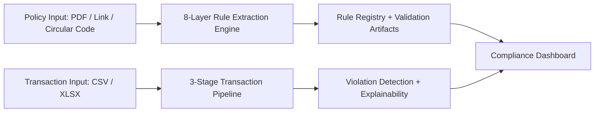

# PolicyGuard AI

<p align="center">
	<strong>Agentic Compliance Intelligence Platform</strong><br/>
	Policy Rule Extraction + Transaction Validation + Explainable Violation Reporting
</p>

<p align="center">
	
</p>

<p align="center">
	
	
	
	
</p>

---

## Vision

PolicyGuard AI is a compliance operations system that:

1. Ingests policy documents and extracts machine-usable rules.
2. Validates large transaction datasets against those rules.
3. Produces explainable, auditable outputs for compliance teams.

The platform combines a high-throughput Python backend with a real-time workflow UI.

---

## Architecture At A Glance



### Architecture Space (Drop-In)

Use this section to add final architecture diagrams and sequence views.

- System context: `docs/architecture/system-context.png`
- Container diagram: `docs/architecture/container-view.png`
- Runtime sequence: `docs/architecture/runtime-sequence.png`
- Data model: `docs/architecture/data-model.png`

Example markdown slots:

```markdown


```

---

## Product Workflow

### Phase 1: Data Ingestion

- Stage 1: Multi-format file parsing
- Stage 2: RBI compliance pre-filtering
- Stage 3: SQLite and Pickle persistence

### Phase 2: Compliance Engine

- 8-layer policy rule extraction pipeline
- Confidence-aware validation and deduplication
- Structured rule normalization for downstream checks

### Phase 3: Explainability and Reporting

- Rule-level violation mapping
- Human-readable rationale generation
- Flagged transaction and report output

---

## 8-Layer Rule Extraction Engine

1. PDF Classifier (digital/scanned/mixed)
2. Semantic Chunker (paragraph-aware)
3. Chunk Filter (non-policy pruning)
4. Adaptive Batcher (token-aware)
5. Parallel Async LLM Router
6. Two-Pass Verifier (critical rule validation)
7. Cache + Progress Streaming (SSE)
8. Dedup + Confidence Validation

Reference: `policyguard-ai/ARCHITECTURE.md`

---

## Repository Structure

```text
Code_apex_hackathon/
├── codeapex/                # 3-stage transaction preprocessing pipeline
├── frontend/                # Next.js dashboard and workflow UI
├── policyguard-ai/          # FastAPI backend and policy intelligence engine
├── transactions.csv         # Root sample transaction input
└── README.md
```

---

## Creative Demo Section (Animation Ready)

Add visual walkthrough assets here once available.

```markdown


```

Suggested clips:

- End-to-end run from policy upload to violations list
- Live progress stream during extraction
- Rule and clause drill-down in the dashboard

---

## Local Setup

### Prerequisites

- Python 3.11+
- Node.js 20+
- npm 10+

### 1) Backend Setup (policyguard-ai)

```bash
cd policyguard-ai
python -m venv .venv
.venv\Scripts\activate
pip install -r requirements.txt
```

Create `.env` in `policyguard-ai/` and define required credentials:

```env
GROQ_API_KEY=
OPENROUTER_API_KEY=
TOGETHER_API_KEY=
SUPABASE_URL=
SUPABASE_KEY=
```

Run API:

```bash
python api/main.py
```

Backend URL: `http://localhost:8000`

### 2) Frontend Setup (Next.js)

```bash
cd frontend
npm install
npm run dev
```

Frontend URL: `http://localhost:3000`

Set API base URL in frontend environment:

```env
NEXT_PUBLIC_API_BASE_URL=http://localhost:8000
```

### 3) Data Pipeline Setup (codeapex)

```bash
cd codeapex
python -m venv .venv
.venv\Scripts\activate
pip install -r requirements.txt
python main.py --file ..\transactions.csv
```

---

## Core API Surface

- `POST /extract` - upload PDF and extract compliance rules
- `POST /extract-from-link` - extract rules from policy URL
- `POST /extract-from-circular` - extract rules from circular code
- `GET /progress/{session_id}` - stream extraction progress
- `POST /validate` - run transaction validation pipeline
- `GET /violations` - fetch violations + explainability payload
- `GET /flagged-transactions` - fetch flagged output artifacts
- `GET /report` - download report artifact
- `GET /health` - service health endpoint

---

## Tech Stack

- Backend: FastAPI, Pydantic, AsyncIO
- AI Pipeline: custom 8-layer extraction architecture
- Data: Pandas, SQLite, Pickle, ChromaDB, Supabase
- Frontend: Next.js 16, React 19, TypeScript, Zustand, Framer Motion
- Reporting and Explainability: structured violation mapping with rule traces

---

## Documentation Map

- `policyguard-ai/ARCHITECTURE.md` - 8-layer backend architecture
- `policyguard-ai/IMPLEMENTATION_GUIDE.md` - backend implementation details
- `policyguard-ai/QUICK_START.md` - fast backend startup
- `codeapex/README.md` - 3-stage data pipeline details
- `frontend/README.md` - frontend setup baseline

---

## Development Standard

This repository is maintained as an architecture-led system:

1. Keep interfaces explicit between frontend, extraction engine, and transaction pipeline.
2. Preserve stage boundaries and typed contracts.
3. Prefer observable execution with progress events and auditable outputs.

